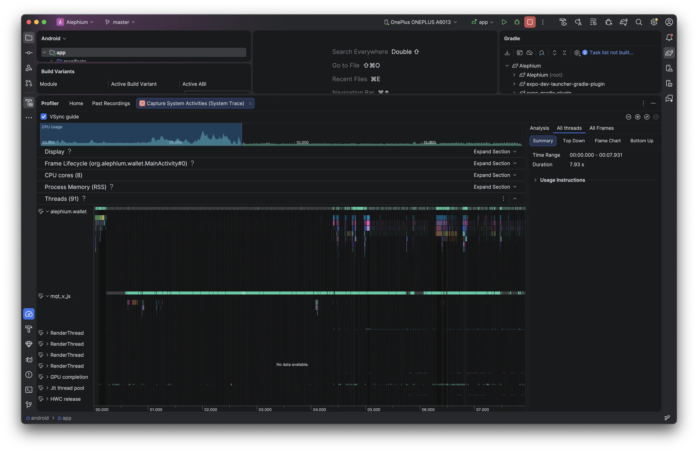
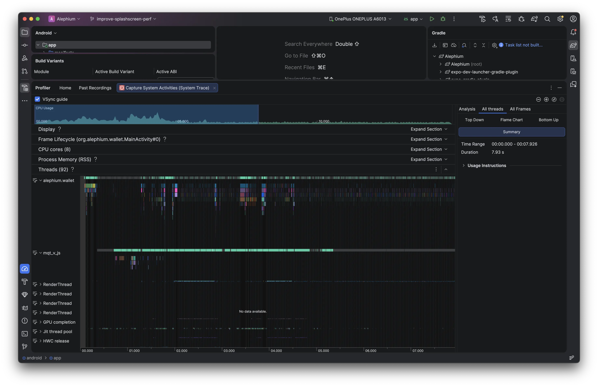
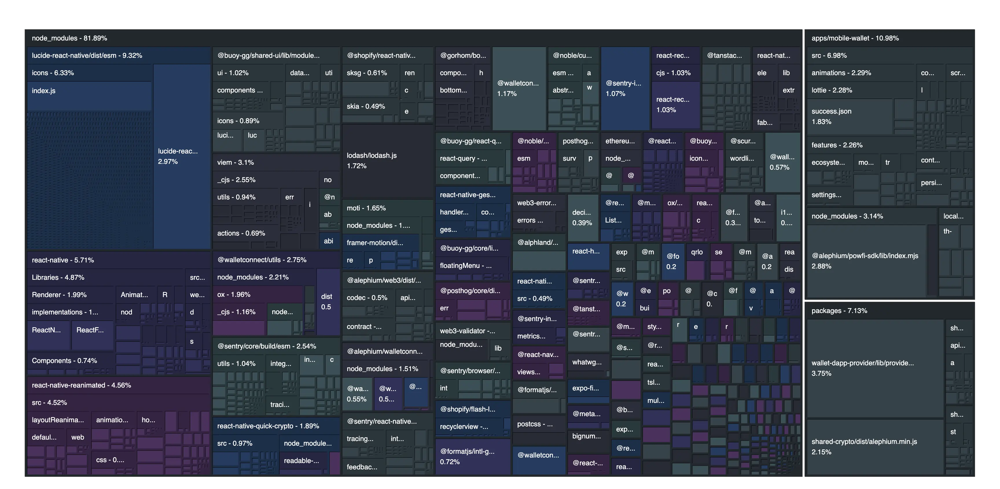

import BreakoutSection from '@components/BreakoutSection.astro'
import TimelineImage from './timeline.svg';

When building a [production-hardened crypto wallet in React Native](/portfolio/alephium-mobile-wallet), your dependency tree can quickly become an absolute galaxy of cryptographic primitives, polyfills, Web3 clients, and heavy wallet connection frameworks. Don't take my word for it, have a look at several good open-source React Native wallets such as:

- [Metamask](https://github.com/MetaMask/metamask-mobile)
- [Rainbow Wallet](https://github.com/rainbow-me/rainbow)
- [Ledger Live](https://github.com/LedgerHQ/ledger-live/)

Recently, I noticed that the Alephium mobile wallet hit a wall: cold-boot startup times crept up to a grueling 7+ seconds. Some users reported waiting up to 15s. I did not manage to reproduce such long times on my devices. It would still take 2s on my Pixel 8 Pro and 4s on my old OnePlus 6T. Nevertheless, I could see through profiling that the native UI thread sat frozen on the splash screen while the single-threaded JavaScript engine spent its precious initialization cycles parsing, evaluating, and spinning up heavy background modules.

By restructuring the compilation pipeline, decoupling native build profiles, and leveraging deferred runtime lifecycles, I managed to drop visual launch times down to a clean 2 seconds with fluid native transitions.

## 1. The Gatekeeper: Global `inlineRequires`

On the web, code-splitting (through `React.lazy`) physically chunks the code to save network bandwidth. On mobile, 100% of the JS bundle is already compiled and sitting locally on the device's flash storage. The bottleneck isn't network download size but CPU execution time instead.

In all Expo projects****** ******by default, standard top-level static imports (`import X from 'Y'`) force the Hermes engine to synchronously execute those modules the exact millisecond the app boots. The breakthrough came from flipping a single global transformer switch in `metro.config.js`:

```js
config.transformer.getTransformOptions = async () => ({
  transform: {
    inlineRequires: true
  },
});
```

### What this actually does

Metro automatically traverses the source files during bundling and rewrites static imports into lazy getters behind the scenes. The heavy screens and services remain completely un-evaluated in memory until the exact microsecond the app explicitly mounts or calls them.

### Profiling in Android Studio

To shed some light into the problem, I opened the `/android` folder in Android Studio to use the profiling tools that the React Native ecosystem is lacking. In the system trace below it can be seen that the massive, pitch-black void on the Native UI thread (`alephium.wallet`) is doing absolutely nothing. The native side of the app is completely functional, but it is idling in an empty loop, stubbornly displaying the splash screen because it has received zero instructions from the JavaScript engine on what layout to draw.

In contrast, at the bottom is the JS thread (`mqt_v_js`). That solid, unbroken turquoise bar running continuously past the 5-second mark is the Hermes JavaScript Engine. It is running a single, massive, synchronous CPU task: parsing the entire codebase and executing all top-level module code. The UI thread cannot drop the splash screen until this turquoise block finishes its initial pass and sends the layout instructions over the bridge.

<BreakoutSection>

</BreakoutSection>

The solution was to let the Metro bundler lazily evaluate the dependencies automatically. By enabling inline requires, Metro automatically rewrites the top-level static imports (`import { Web3Provider } from 'walletconnect'`) into localized requests (`require('walletconnect')`) behind the scenes. This means that heavy depedencies such as WalletConnect are completely ignored during the initial startup script (bringing the boot time down) and they are loaded incrememtally only when an explicit function call executes them later on.

The visual profile has completely shifted:

- The Native UI thread (`alephium.wallet`) awakens: Instead of a long black void of idling, you see a dense cluster of vibrant, multi-colored execution blocks firing early in the timeline (around the 1-second mark). These blocks represent native Android view layout measurements, `MainActivity` lifecycle passes, and paint calls.
- The JavaScript thread (`mqt_v_js`): While the turquoise bar still runs to process code, its initial execution payload is split. It processes the root entry logic rapidly, unblocks the bridge early, and allows the native system to start drawing UI elements and managing transitions while other deferred modules are processed in the background.

<BreakoutSection>

</BreakoutSection>

### Why does changing the Metro bundler configuration suddenly wake up the native Android thread?

Without `inlineRequires`, the bundle acts like a giant synchronous waterfall. The app cannot display the first screen until every single file, even code for deep sub-navigation screens the user has't opened yet, is fully evaluated by the CPU. The native UI thread is held hostage by the JavaScript thread.

When we flip `inlineRequires: true`, Metro rewrites our top-level static imports into lazy function wrappers (`require()`). This completely changes the low-level thread execution:


- The initial JS payload shrinks: Only the absolute bare-minimum framework code is executed on boot.
- The bridge fires early: The JS thread finishes its initial pass in under a second and immediately sends the root view structure to the native side.
- True parallel execution: As seen in the optimized trace, the native UI thread goes to work immediately drawing the initial views and preparing transitions, while the Hermes engine processes deferred modules and heavy crypto packages in parallel when they are explicitly called.

### Step-by-step anatomy of a RN cold start

Let's look under the hood on what's happening when we write and build our project and when we launch the app.

#### Phase 1: Compile

When we write code, we use startard ES6 static imports at the top of the files for readability and type safety:

```ts
// Inside SendScreen.tsx
import WalletConnectClient from '~/services/walletConnectService';

export const SendScreen = () => {
  // Uses WalletConnectClient...
};
```

When we build the project, the Metro bundler traverses the project files. Because `inlineRequires` is set to `true`, Metro modifies the source code as it compresses it into the final `index.android.bundle` file. It strips away the top-level import and wraps it in a lazy JS getter property (hence the "inline" naming):

```js
// What Metro outputs
Object.defineProperty(exports, "WalletConnectClient", {
  get: function() {
    return require('~/services/walletConnectService'); 
  }
});

const SendScreen = () => {
  // Every time you call 'WalletConnectClient', it triggers the getter function above
};
```

#### Phase 2: App launch (cold start)

When the user taps the app icon on their phone, a strict sequence of events plays out across the native OS and the JS engine:

##### Step 1: Native process forking (0.0s)

The Android OS forks a native Linux process for the app. The Android Runtime (ART) initializes the app's container, reads the `AndroidManifest.xml`, creates the main native thread, and calls `bindApplication`.

##### Step 2: Native splash screen mounts (~0.2s)

The native UI thread (`alephium.wallet`) loads the theme configurations and instantly draws the native splash screen layout. The phone is now frozen displaying this layout, waiting for instructions on what to replace it with.

##### Step 3: The JS thread spawns (~0.4s)

The native side boots up the Hermes JS engine on a dedicated background thread (`mqt_v_js`). Hermes allocates its memory heap and reads the production bundle file (`index.android.bundle`) from the phone's internal storage into its RAM.

##### Step 4: Grobal script evaluation

This is where the big performance difference happens. Hermes must execute the entire global scope of the bundle to discover the registered application components.

**Without inline requires (the old way)**: Hermes runs the entry file. It sees a top-level static import for `SendScreen`. To resolve it, it must immediately jump to `SendScreen.tsx`, parse it, and execute it. Inside `SendScreen`, it hits the static import for WalletConnect. It stops, jumps to WalletConnect, parses its dependencies, instantiates the cryptographic polyfills, and runs heavy initialization setups. This reates a big domino effect. Thousands of files are synchronously read, parsed, and executed in one continuous, blocking CPU loop. The JS thread pins at 100% (the long turquoise bar), and the native UI thread sits in total darkness, unable to drop the splash screen.

**With inline requires (the optimized way)**: Hermes runs the entry file. It encounters the lazy properties created by Metro. It skips the contents, sinice its code is wrapped in a getter closure. Instead of evaluating thousands of files, Hermes merely maps out the lightweight getter references in memory. The entire initial bundle execution pass finishes in a fraction of a second.

#### Phase 3: Handover and lazy runtime evaluation

##### Step 5: Unlocking the bridge (~1.5s)

Because Hermes finished its initial script evaluation pass quickly, it immediately reaches the root `AppRegistry.registerComponent` call. It executes `App.tsx` and sends a layout tree over the native bridge to the native UI thread.

##### Step 6: Splash screen drops (~1.8s)

The native UI thread receives its first set of design instructions from JS. It tears down the native splash screen layout, mounts the root `SafeAreaProvider` container, and displays the compiled view structure. The visual boot process is complete.

##### Step 7: On-demand lazy execution at runtime

Now the app is open and fully interactive. Eventually, a deferred layout hook forces the code to read an object belonging to the WalletConnect service:

```ts
const client = await WalletConnectService.init();
```

The exact microsecond theat variable name is evaluated, the JS engine triggeres that hidden `get()` function Metro generated back in Phase 1. Hermes synchronously pauses for a few microseconds, reads the local file bytes for the WalletConnect client, evaluates the cryptographic libraries for the first time, caches the instance in memory so it never has to do it again, and completes the function call.

<TimelineImage/>

The app structure went from a big upfront waterfall to an incremental on-demand execution system. The binary footprint stays exactly the same but the hardware treats it with efficiency.


## 2. Reducing bundle size

The bundle size affects startup time. Expo provides a useful dev package called `expo-atlas`. It can analyze the JS bundle and give useful information to regarding depedencies and code. The initial bundle size of the mobile wallet was `37.8MB` with `6622` modules. After several rounds of optimizations, I managed to reduce it down to `27.2MB` with `4351` modules:

- Replaced `lucide-react-native` with `@react-native-vector-icons/lucide`: The initial icons library took `~9%` of the total bundle size. This was a low-hanging fruit.
- Got rid of `viem`: I was surprised to see that we needed this library. Using `pnpm why viem` revealed that the only package using it is `@walletconnect/utils`. With an investigation on GitHub I realized that this dependency does not exist in a following minor release of the depedency. So I edited `package.json` and updated the `overrides` section to load the new version.
- Commented out devtools: I was even more surprised to see that the devtools contributed to production release bundle size.
- Optimized Lottie animations: A particular lottie file was almost `2%` of the bundle size. Simply replacing it with a more optimized one shaved off several KB.

<BreakoutSection>

</BreakoutSection>

## Learnings

### The `React.lazy` trap: Why web optimizations fail on mobile

Coming from a React web background, my immediate instinct to fix a heavy screen is to reach for `React.lazy(() => import('./SendScreen'))` and wrap it in a `<Suspense>` boundary. On a desktop browser, this is a gold standard. On a native mobile device, it is an anti-pattern that actively degrades user experience. The friction comes down to a fundamental misunderstanding of what we are optimizing for on different platforms:

- On the web: The primary constraint is **network bandwidth**. `React.lazy` instructs the bundler to split a screen into a separate chunk (`sendScreen.chunk.js`) so the user doesn't waste data downloading code they might never look at over cellular networks.

- On mobile: The primary constraint is **CPU execution**. 100% of the JavaScript bundle is already compiled and sitting locally on the physical storage of the phone. There is zero network latency when moving between screens.

When wrapping a mobile layout component in `React.lazy`, you force React to treat a local, instantaneous file read as a slow, asynchronous Promise. When a user taps a navigation button, the native stack navigator immediately tells the GPU to kick off a fluid, hardware-accelerated slide or cross-fade transition. But because of `React.lazy`, the destination screen hits an unexpected `<Suspense fallback={null}>` wall. The native transition drops frames, jitters, or flashes a blank background while the JavaScript engine waits for the micro-task queue to click over and resolve the promise.

Instead of fighting the architecture with manual web code-splitting, keep the imports standard and static:

```ts
import SendScreen from '~/navigation/SendScreen';
```

By leaning entirely on global `inlineRequires` in the Metro configuration, the bundler defers parsing the file until it's called, but handles the resolution synchronously from local flash storage. This gives you total protection against cold-start bloat without sacrificing buttery-smooth, native hardware transitions.

## Troubleshooting

To setup Android Studio, these are some things I had to do:

### A problem occurred starting process 'command 'node'

Launch app from the `/android` directory with 
```
open -a "Android Studio"
```

### Inconsistent JVM-target compatibility detected for tasks 'compileDebugJavaWithJavac' (17) and 'compileDebugKotlin' (21).

Even though I am using Expo 54 and React Native 0.81, the [docs still recommend using Java 17](https://reactnative.dev/docs/set-up-your-environment). Enforce a matching target version globally. 

```
npx expo install expo-build-properties
```

Open your root `app.config.js` and add the plugin configuration to explicitly pin the Java version to 17 across both toolchains:

```json
{
  "expo": {
    "plugins": [
      [
        "expo-build-properties",
        {
          "android": {
            "javaVersion": "17"
          }
        }
      ]
    ]
  }
}
```

Regenerate native directories with:

```
npx expo prebuild --clean
```

### Invalid Gradle JDK configuration found.

Change Gradle JDK location and select `JAVA_HOME`.

### White screen when starting profiling process

It helps to first build the release variant with:

```
npx expo android:run --variant release
```

### Making app profilable

Update your `app.config.js` file with:

```js
// Injects the <profileable android:shell="true" /> tag into your production manifest
const withProfileableManifest = (config) => {
  return withAndroidManifest(config, (modConfig) => {
    const mainApplication = modConfig.modResults.manifest.application[0];
    if (!mainApplication['profileable']) {
      mainApplication['profileable'] = [{
        $: { 'android:shell': 'true' }
      }];
    }
    return modConfig;
  });
};

module.exports = {
  expo: {
    // ... your other existing configurations
    plugins: [
      withProfileableManifest, // 👈 Add the new manifest plugin here
      // ... your other plugins
    ]
  }
};
```

### Build variants panel

Make sure to enable the _Build variants_ panel (through the _View_ menu item) and set the `:app` module's active build variant to `release` and Active ABI to `arm64-v8a` (or whatever arch your Android device has). Then click `Profiler: Run 'app' as profileable (low overhead)` from the top bar play icon.

---

Useful resources:
- https://docs.expo.dev/guides/tree-shaking/
- https://reactnative.dev/docs/optimizing-javascript-loading
- https://docs.expo.dev/guides/analyzing-bundles/