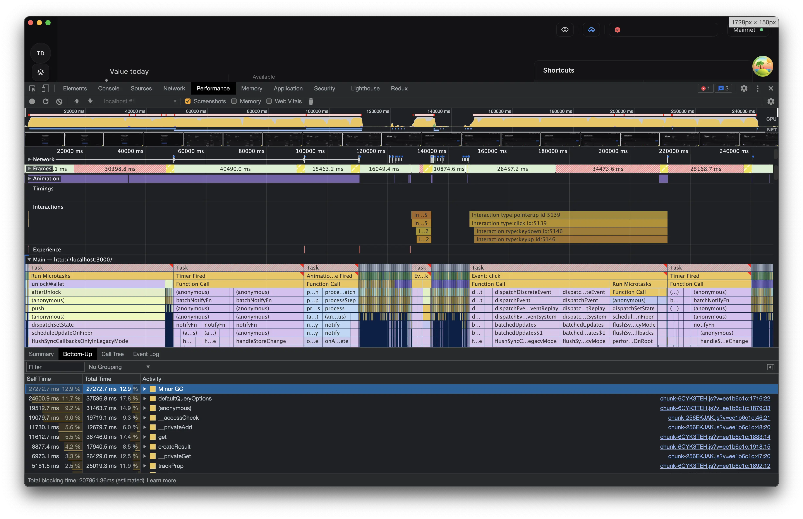

import SeriesNav from '@components/SeriesNav.astro'
import DraftNote from '@components/DraftNote.astro'
import TLDR from '@components/TLDR.astro'
import BreakoutSection from '@components/BreakoutSection.astro'

<SeriesNav series="tanstack-query-case-study" current={4} />

[Part 3](/blog/tanstack-query-change-detection-polling) got the request count under control by gating everything behind a single cheap poll. But the migration that cut the requests also created a bottleneck of its own: **the CPU**. Almost no component wants a raw API response. It wants data derived from several of them, and deriving that data inside every component is what made the app janky. The old Redux architecture never had this problem, because it computed each derivation once, into the store (the exact hesitation from [Part 2](/blog/redux-to-tanstack-query-migration)). The naive TanStack version multiplied it by every component that asked.

<TLDR>

- Deriving wallet data inside each component made the app sluggish. My derive functions were cheap; what melted the CPU was TanStack's per-observer bookkeeping, multiplied across thousands of `QueryObserver`s.
- Fix 1: push composition into a `queryFn` that pulls its dependencies via `queryClient.fetchQuery`, so the computed result is cached once and shared everywhere.
- Fix 2: hoist the wallet-wide `useQueries` fan-out into a React Context (dependency injection, not a second store) so it runs once for the whole tree.
- `select` is the lighter tool for single-source slicing; `fetchQuery`-in-`queryFn` is for cross-source composition, at the cost of owning invalidation.

</TLDR>

## The problem

### Wallet worth calculation

To calculate the worth of the wallet, we need to:

- find out the balances of each token for every address
- find out the price of each token
- multiply token price with its balance and sum the results

To get the token balances of every address, we need to:

- call the address ALPH balance endpoint
- call the token balances endpoint

The above will return a list of token IDs and their balances.
To get prices we need the token symbol (like USDT, ALPH, etc.).

- get token symbols by fetching the latest token list from GitHub.
  This is a JSON file mapping token IDs to metadata (including the token's symbol, like WETH).
- get token prices by calling the token prices endpoint and passing the list of symbols

We can now multiply the balance with the price and sum the results for every address to finally calculate the wallet's worth.

## The symptom

The dashboard janked. Scrolling the token list stuttered, and every background refresh blocked the UI. It was not a network problem ([Part 3](/blog/tanstack-query-change-detection-polling) had already tamed the requests); it was the CPU.

I loaded my wallet, and profiled the Electron renderer through four minutes of completely ordinary usage: unlock the wallet, wait for it to settle, click to the Addresses page, click back to the Overview. (Development build, so the absolute numbers are inflated. The shape is what matters.)

<BreakoutSection>

</BreakoutSection>

The trace reads like a crime scene:

- **Total blocking time: 207,861 ms.** Three and a half minutes of blocked main thread in a four-minute recording.
- **Unlocking** ran back-to-back main-thread tasks of 47.7s, 43.0s, and 17.9s: about 109 seconds of continuous freeze.
- **Navigating to the Addresses page** blocked for about 7 seconds. **Navigating back to the Overview** produced a single 65-second task followed by a 27-second follow-up: about 93 seconds, from one click.
- The Frames track shows stretches of 30 to 40 seconds where the app shipped **zero frames**.

For calibration: the same four actions on the pre-TanStack build cost **2.4 seconds** of total blocking time. This jank was not inherited. It was new, and it was mine.

Two details in that trace taught me the most. First, the 65-second block is *one task*: with React's legacy sync rendering, the entire notify-and-re-render avalanche completes in a single turn of the event loop, which is why the app cannot even repaint while it happens. Second, the asymmetry: leaving the dashboard cost 7 seconds, returning to it cost 93. The page being *mounted* pays the observer bill, and the dashboard, with its wallet worth total and token lists fanning out across every address, has by far the biggest bill.

The profiler pointed the finger at long-running functions **inside the TanStack Query library itself**, not my own code. But *which* functions surprised me, and it is worth being precise about, because I had misdiagnosed it until I measured.

## The problem, in code

Almost no component wants a raw API response. They want derived data: the wallet's total balance across all addresses, the list of tokens separated into listed fungibles, unlisted fungibles, and NFTs, the fiat value of a holding. Early on, every component that needed this computed it itself, with a hook shaped like this:

```tsx
// The naive version: every component that needed the wallet's tokens called a hook like this.
const useWalletTokensByType = () => {
  const addressHashes = useUnsortedAddressesHashes()

  return useQueries({
    queries: addressHashes.map((hash) => addressTokensBalancesQuery({ hash, networkId, isNodeOnline })),
    // This combine re-derives the same result on every render, in every component that calls the hook.
    combine: (results) => separateTokensByType(results) // sort, group by standard, merge metadata, fold balances…
  })
}
```

Twenty components calling a hook like that created twenty sets of observers and ran `separateTokensByType` twenty times on every render.

For a long time, my diagnosis was structural sharing: TanStack's `replaceEqualDeep` walking large token arrays once per observer. The profiler says otherwise. `replaceEqualDeep` accounts for well under a tenth of a second, and my `combine` callbacks for even less, in traces where the main thread was pegged for minutes. What actually dominated was the bookkeeping TanStack performs **for each observer**: `defaultQueryOptions` (re-defaulting the options of every query, of every hook, on every render), `trackResult`'s property-tracking wrappers, `createResult`, query-key hashing, and a garbage collector spending 13 to 24 percent of the entire trace sweeping up after all of it.

The mechanic that makes this multiply is the one TkDodo documents for `select`: it [runs once per `QueryObserver`](https://tkdodo.eu/blog/react-query-selectors-supercharged), and so does all the machinery around it. Nothing about an observer's work is deduplicated across components: thirty components calling the same hook means thirty observers per underlying query, each paying the full bookkeeping bill. With a wallet of dozens of addresses, hooks like the one above multiplied into thousands of observers. While optimizing, [we counted a single hook being called 1,398 times](https://github.com/alephium/alephium-frontend/pull/1037) during one wallet unlock. Stabilizing the selector with `useCallback`, the usual first advice, does nothing here, because the cost is per-*observer*, not per-render. The fix had to do two things: run the expensive composition once, and drastically cut the number of observers.

## Fix 1: compute once, cache the result

The first move was to push the composition into a `queryFn`, and let TanStack cache the computed result under its own key. A query's `queryFn` can pull its dependencies straight from the cache with `queryClient.fetchQuery` (which deduplicates and shares the cache with any `useQuery` on the same key). This is exactly the [pattern Dominik Dorfmeister endorses](https://github.com/TanStack/query/discussions/2178):

> "you can use `queryClient.fetchQuery` inside a `queryFn` of another query."

That is what the `level:N` keys are about: they are a derived-data dependency graph. Level 1 composes the two level-0 balance queries:

```ts
export const addressBalancesQuery = ({ addressHash, networkId, isNodeOnline, skip }) =>
  queryOptions({
    queryKey: ['address', addressHash, 'level:1', 'balances-all', { networkId }],
    ...getQueryConfig({ staleTime: Infinity, gcTime: Infinity, networkId }),
    queryFn: shouldSkip(isNodeOnline, skip)
      ? skipToken
      : async () => {
          // Compose from the cached level-0 queries (fetched once, shared everywhere).
          const { balances: alph } = await queryClient.fetchQuery(addressAlphBalancesQuery({ addressHash, networkId, isNodeOnline, skip }))
          const { balances: tokens } = await queryClient.fetchQuery(addressTokensBalancesQuery({ addressHash, networkId, isNodeOnline, skip }))

          return {
            addressHash,
            balances: alph.totalBalance !== '0' ? [{ id: ALPH.id, ...alph }, ...tokens] : tokens
          }
        }
  })
```

Source: [`addressQueries.ts`](https://github.com/alephium/alephium-frontend/blob/4d85289ce20d1b2eea5a3960ec2800750cefe7ca/packages/shared-react/src/api/queries/addressQueries.ts)

The consumer is now trivial, `useQuery(addressBalancesQuery(...))`, with **zero computation in the component.** The expensive composition happens once, is stored once, and is structurally shared once. The same idea powers [`tokenQuery`](https://github.com/alephium/alephium-frontend/blob/4d85289ce20d1b2eea5a3960ec2800750cefe7ca/packages/shared-react/src/api/queries/tokenQueries.ts), which resolves any token ID by chaining `fetchQuery` calls: check the token list, then the token type, then the appropriate metadata, caching the resolved token under its own key.

## Fix 2: hoist the fan-out into a context

A "fan-out" is one logical need that expands into many parallel requests: "show the wallet's tokens" becomes one query per address. `fetchQuery`-in-`queryFn` solves cross-query composition, but a hook that does `useQueries` across all 50 addresses still creates 50 observers per component that calls it. So I hoist those wallet-wide fan-outs into a React Context that runs the `useQueries` once for the whole tree. A small factory builds these:

```tsx
export const createDataContext = ({ useDataHook, combineFn, defaultValue }) => {
  const DataContext = createContext({ data: defaultValue, isLoading: false, isFetching: false, error: false })

  const DataContextProvider = ({ children }) => {
    // The expensive useQueries fan-out + combine runs ONCE here, not in every consumer.
    const { data, isLoading, isFetching, error } = useDataHook(combineFn)
    const value = useMemo(() => ({ data, isLoading, isFetching, error }), [data, isLoading, isFetching, error])
    return <DataContext.Provider value={value}>{children}</DataContext.Provider>
  }

  return { useData: () => useContext(DataContext), DataContextProvider }
}
```

Source: [`createDataContext.tsx`](https://github.com/alephium/alephium-frontend/blob/4d85289ce20d1b2eea5a3960ec2800750cefe7ca/packages/shared-react/src/api/context/createDataContext.tsx)

This is React Context used the way [TkDodo recommends](https://tkdodo.eu/blog/react-query-and-react-context), as dependency injection, not as a second state store. The single source of truth is still the query cache; the context just hoists the subscription and the `combine` to one place so consumers read a ready-made value.

The payoff was measured twice. During the optimization itself, [we counted hook invocations](https://github.com/alephium/alephium-frontend/pull/1037) on a single wallet unlock: `useFetchWalletBalancesAlphByAddress` went from **1,398 calls to 3**, and the refactor cut `combine` executions by 99.7% overall. And profiling today's build through the same four actions as the trace above: total blocking time fell from **207.9 seconds to 1.9**, a 107x reduction, and the click back to the Overview went from 93 seconds of freeze to about a quarter of a second.

## Why two tools, not one

The split is deliberate, and it maps onto where each tool can reach:

- **Single-source derivation** (slice one query) uses `select`. It is the lighter tool, it recomputes reactively from live data, and crucially it carries **no manual-invalidation burden.** I use it for things like "this one token's balance out of the address's balance list."
- **Cross-source composition** (combine multiple queries) uses `fetchQuery`-in-`queryFn`, because `select` only ever sees one query's data. The price is that the derived entry caches a snapshot and does not auto-recompute when its sources change, so I own its invalidation. Concretely, when the [Part 3](/blog/tanstack-query-change-detection-polling) gate detects a change it does not just refetch the raw balances; it invalidates the derived queries in dependency order, level 0 before the level 1+ entries that read it, so each one recomputes on fresh inputs. That ordering is exactly what the `level:N` key names encode.

## An alternative I weighed: aggregates as cached queries

I could have gone further and discarded React Context entirely, turning each wallet-wide aggregate (the total balance, the tokens-by-type list) into its own `fetchQuery`-in-`queryFn` query keyed on the address set. It is worth saying why I mostly did not.

What that buys you: one mechanism instead of two, and, more interestingly, the aggregate becomes a cached entry that persists to disk. On cold start the wallet total would be there instantly, with no recompute, which is exactly the philosophy of [Part 5](/blog/tanstack-query-persist-cache-cold-start). Context-derived values are recomputed on every mount.

What it costs you:

- **Reactivity.** `useQueries` + `combine` re-runs automatically when any underlying address query changes. A cached aggregate is a snapshot you must fold into the invalidation cascade by hand, more of the coherence-ownership tax from [Part 3](/blog/tanstack-query-change-detection-polling).
- **Partial loading state.** `combine` can report "some addresses are still loading" and let the UI fill in incrementally as each one resolves. A single aggregate query is all-or-nothing: nothing renders until the whole `queryFn` finishes.
- **Dynamic address sets.** With `useQueries` the address list is just the queries array. As a query, the set goes into the key, so adding an address spawns a fresh entry and leaves the old one lingering until garbage collection.

The sharp version of the trade: move the all-or-nothing aggregates that benefit from persistence (the wallet total) to cached queries, and keep Context only where consumers need partial, incremental loading across a changing address set. I kept Context for the dashboard aggregates precisely because the per-section loading states matter there.

## A direction I want to explore: jotai

Full disclosure: I did not weigh [jotai-tanstack-query](https://jotai.org/docs/extensions/query) against this design, for the unglamorous reason that I did not know it existed at the time. I want to look into it, because on paper it addresses things I solved by hand. Jotai derived atoms compute once, are shared across all subscribers, recompute automatically when their sources change, and re-render only the components reading them. That would, in principle, collapse my hand-written level cascade: derived atoms would recompute themselves when a source changes, instead of me invalidating six levels in order.

Two things make me cautious for these particular apps. The wallets already run Redux Toolkit, so adding Jotai means a third state paradigm and a "which state lives where" tax. And jotai's derive-on-read recomputes derived data lazily, which is the opposite of what the cold-start path needs (the subject of [Part 5](/blog/tanstack-query-persist-cache-cold-start)). So it sits firmly on my "investigate later" list rather than being a regret. If you have shipped jotai-tanstack-query at this kind of scale, I would genuinely like to compare notes.

## Trade-offs and what I would improve

- **I own invalidation for every derived query.** Forget to invalidate a level and it serves a stale snapshot forever. The `level:N` convention makes this systematic, but it is a convention, not a guarantee, a refactor away from a subtle bug.
- **Context still fans out re-renders.** Any single address's balance change produces a new memoized context value and re-renders every consumer. I measured this and it is fine today, but at whale-wallet scale `use-context-selector` or finer-grained contexts would localize it.
- **I predicted the invalidation cascade would be the next hotspot, and measurement proved me wrong.** For a while the largest remaining TanStack cost in my profiles was `partialMatchKey`/`matchQuery` walking the cache, and I assumed the `level:N` cascade was to blame, since `invalidateQueries` is O(cache size) and the cascade calls it once per level, per address. Attributed properly (by caller chain, not raw self time), the cascade was ~20ms. The real cost, 3.2 seconds on a cold start, was a single `useIsFetching({ predicate })` in the always-mounted header refresh button: TanStack re-runs that predicate against **every cache entry on every cache event**, and mine did an O(addresses) `includes` on top. Swapping it for a small incremental cache subscription (O(1) per event) took the scans to zero, and collapsed the `notifyManager` timer churn with it, since each of those events had also been scheduling a `setTimeout(0)` flush. The lesson:

**`useIsFetching` with a predicate is a full-cache scan per cache event and does not belong in an always-mounted component.**

## Learnings

### Own your coherence when you leave the library's guarantees

The single most important thing I internalized is that the moment you step outside `staleTime` + `invalidateQueries`, the moment you build a change detector, or cache a derived snapshot, **you have taken ownership of cache coherence from the library.** Every one of this architecture's real bugs (the locked-balance staleness from [Part 3](/blog/tanstack-query-change-detection-polling)) lives exactly at the seam where my hand-rolled invariant leaks. That is not an argument against doing it; the request savings are enormous and real. It is an argument for knowing, precisely, which invariant you are now responsible for upholding, and auditing where it can break.

### Compute once, cache many, invalidate precisely

The through-line of the whole design is the same shape repeated at three scales: do not recompute what you can cache (this part's derived queries), do not refetch what cannot have changed ([Part 3](/blog/tanstack-query-change-detection-polling)'s gate), do not re-derive on a cold path what you can persist already computed ([Part 5](/blog/tanstack-query-persist-cache-cold-start)'s connect modal). TanStack's cache is the natural home for all three, as long as you respect that `select` and `combine` are per-observer and that a cached derivation is a snapshot, not a subscription.

### My constants are calibrated by vibes

If there is one honest weakness that cuts across the whole series, it is this: every numeric boundary in the system, the 60-second and 5-minute poll tiers, the 30-day active/dormant split, the 10-req/s throttle, the retry count, was chosen by feel and validated by the absence of complaints. The architecture is sound; its calibration is intuition. The cheapest, highest-leverage improvement I could make is to replace those magic numbers with measured, server-header-driven values so the system tunes itself instead of relying on my guesses.

## What comes next

Even with requests gated and derivations cached, one path stays slow: the cold start, when there is nothing in the cache yet and a big wallet has to fetch everything before it can paint a single balance. [Part 5 is about persisting the cache to disk](/blog/tanstack-query-persist-cache-cold-start) so the app restores last session's data instantly, and the batch, throttle, and retry layers that keep the whole system under the rate limit.
