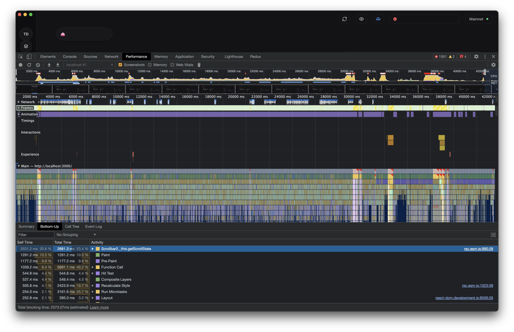

import WalletDataFlow from '@components/animations/WalletDataFlow.astro'
import ReduxDataFlow from '@components/animations/ReduxDataFlow.astro'
import BreakoutSection from '@components/BreakoutSection.astro'
import SeriesNav from '@components/SeriesNav.astro'

<SeriesNav series="tanstack-query-case-study" current={1} />

A pretty common need on the client side of web and mobile applications is managing **asynchronous state**, data that lives on the server. The Alephium mobile and desktop wallets are no exception. This series is a case study of using [TanStack Query](https://tanstack.com/query/latest) to manage async state in real production apps. In it, I describe the problems I faced building them, and the solutions I architected and implemented to address them.

This first article sets the scene. Before any solution makes sense, I want you to feel the three problems that made the old architecture untenable. The solutions come in the articles that follow. I would recommend not skipping ahead so that it all makes sense!

## The apps

Here is a quick overview of what these apps are and what they run on.

The [Alephium desktop wallet](/portfolio/alephium-desktop-wallet) is an Electron app for macOS, Windows, and Linux. It lets the user create and securely store cryptocurrency wallets. A wallet, to its core, is simply a list of 24 words called a "mnemonic". Multiple addresses (think IBAN) can be derived from this mnemonic. The user can send funds to and from these addresses. The user can create as many addresses as they want. Funds can be ALPH (the native token), tokens (USDT, wETH, and so on), and NFTs. The [Alephium mobile wallet](/portfolio/alephium-mobile-wallet) is a React Native app for Android and iOS, in feature parity with the desktop wallet.

Both trigger a massive **fan-out architecture** from the frontend's perspective: one wallet holds many addresses, and each address needs its balances, its tokens, its NFTs, and their metadata, each from a different API endpoint. The apps must manage, trigger, and resolve all these concurrent, sometimes independent and sometimes interdependent requests.

<WalletDataFlow />

The rest of this post is about what happens when that simple picture meets a real wallet with dozens of addresses and hundreds of tokens.

## Problem 1: the request flow is hard to reason about

As I explain on my [portfolio page for the desktop wallet](/portfolio/alephium-desktop-wallet), the very first implementation kept both app state and async state in a plain `React.Context`, with network requests fired by `fetch` inside `useEffect` hooks. That was the state of things when I joined the team in 2021. Soon after I joined, and once we started hitting some performance bottlenecks, I proposed migrating to more sophisticated state management with Redux Toolkit. This was the first major project that I owned. Network requests moved into async thunks, triggered from `useEffect` hooks, and the resulting (computed) async state lived in Redux. This made a lot of sense at the time, considering that the blockchain did not yet support smart contracts. There was no need for something more complex. A few years down the line, however, the Alephium blockchain was supercharged with smart contract support, which led to a Cambrian explosion of tokens and NFTs.

<ReduxDataFlow />

The migration to Redux bought us an efficient rendering strategy: when a slice of state changed, only the components consuming that exact slice re-rendered. The cost was that as the project evolved the logic _triggering_ those network requests became genuinely hard to follow.

Here is the happy path on app unlock:

1. The app initializes Redux with the list of addresses found in `localStorage`.
2. That list sits in the dependency array of a `useEffect` in `App.tsx`, which calls the `fetchAddressesBalances` thunk.
3. The thunk makes its network requests, writes the balances into Redux, and flips `isBalancesInitialized` to `true`.
4. _Another_ `useEffect` has that flag in its dependency array. When it becomes `true`, it fires `fetchTokensDetails` to fetch metadata (name, logo, symbol) for the token IDs discovered in the previous step.

So a single unlock moves back and forth between Redux state, `useEffect` dependency arrays, and async thunks. To trace one user action the developer has to hold the whole zig-zag in their head.

## Problem 2: too many requests

The desktop wallet's user base grew, and the server grew overloaded with requests. The wallets were essentially DDoS-ing our own backend. The backend team had to add rate-limiting, which fixed the server side but created a new problem on the client side: the server now frequently responded with `429 ("Too Many Requests")` and the apps displayed inaccurate data.

The patch was obvious: throttle the number of requests the clients send, and add a retry policy for `429` responses. A combination of [`p-throttle`](https://www.npmjs.com/package/p-throttle) and [`fetch-retry`](https://www.npmjs.com/package/fetch-retry) replaced the bare `fetch` calls:


```ts
import pThrottle from 'p-throttle'
import fetchRetry from 'fetch-retry'

const throttle = pThrottle({
  limit: 10,
  interval: 1000
})

const throttledFetch = throttle((url, options = {}) => {
  fetch(url, options)
})

const MAX_API_RETRIES = 3

const exponentialBackoffFetchRetry = fetchRetry(throttledFetch, {
  retryOn: (_, __, response: Response | null) => {
    return !!response && response.status === 429
  },
  retryDelay: (attempt: number) => {
    return Math.pow(2, attempt) * 1000
  },
  retries: MAX_API_RETRIES
})
```


This saved the day. The server could keep up, and the client _slowly_ received all the data it needed, eventually showing up-to-date information. But, as you may already suspect, this created a _new_ problem.

## Problem 3: painfully slow data updates on app launch

Throttling solved the symptom but not the cause. The client still fired _way_ too many requests on app launch. It just fired them out slowly. This meant that the user would stare at skeleton loaders for a considerable amount of time each time they launched their app until they were able to see their balances.

Here's a breakdown of a profiling session of a power user's wallet of 42 addresses, 203 tokens, and 360 NFTs. The actions performed were to unlock the wallet, wait for it to settle, click to the Addresses page, click back to the Overview. It revealed some interesting insights:

<BreakoutSection>

</BreakoutSection>

- **1,709 requests fired in 43 seconds.** The real fan-out was six endpoints per address.
- 700 of them left in the first ten seconds. The server rejected **981 with `429`**, and the exponential-backoff retries stretched the data trickle past the 40-second mark.
- With no request deduplication, the same price-chart URL was fetched 17 times within the recording.
- The CPU, meanwhile, was mostly idle (total blocking time: 2.4 seconds). The app was not slow because it was working hard. It was slow because it was waiting.

What's worse is that every async state update even after the initial launch would also fire the same number of requests, taking the same amount of time.

We had to attack the real problem: **fire dramatically fewer requests in the first place.**

## Network requests batching

A low-hanging fruit was to batch the network requests for token metadata. Token metadata is the worst fan-out: resolving 200 tokens used to be 200 requests. The idea to reach for [`@yornaath/batshit`](https://github.com/yornaath/batshit) came from my colleague [Mika](https://x.com/mikalph), and it turned out to be a very effective lever against the `429`s. It collects individual lookups inside a 10ms window and fires one batched POST of up to 80:

```ts
import { create, windowedFiniteBatchScheduler } from '@yornaath/batshit'

// Up to 80 individual token-metadata lookups made within a 10ms window collapse into one POST.
const createFTMetadataBatcher = () =>
  create({
    fetcher: throttledClient.explorer.tokens.postTokensFungibleMetadata,
    resolver: (results, queryTokenId) => results.find(({ id }) => id === queryTokenId),
    scheduler: windowedFiniteBatchScheduler({ maxBatchSize: 80, windowMs: 10 })
  })
```

Source: [`queryBatchers.ts`](https://github.com/alephium/alephium-frontend/blob/4d85289ce20d1b2eea5a3960ec2800750cefe7ca/packages/shared/src/api/queryBatchers.ts)

The biggest gains in reducing the number of requests, however, comes next.

## What comes next

I worked closely with the backend team, and together we landed on a multi-layer solution that addressed **all three problems** at once: the tangled flow, the request flood, and the slow updates. The foundation of that solution is TanStack Query.

In the next parts of this series I'll walk through that architecture: how I migrated the whole async layer off Redux and onto TanStack Query, how I gate expensive queries behind a single cheap poll so balances only refetch when something actually changes, how I compose derived state without melting the CPU, how I persist the cache for instant cold starts, and the layered defense that keeps all of it under the rate limit. Each layer is a direct answer to one of the three problems above.

Onward to [Part 2, where I migrate the async layer off Redux and onto TanStack Query](/blog/redux-to-tanstack-query-migration).
